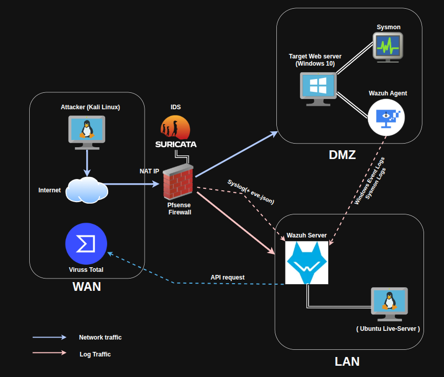

# Triển khai mô hình SOC Mini: Giám sát, Cô lập DMZ và Phản ứng tự động với Wazuh & pfSense.

**Mục tiêu:** Xây dựng một môi trường mạng doanh nghiệp thu nhỏ, áp dụng nguyên tắc **Zero Trust** và **Network Segmentation** (Phân vùng mạng) để cô lập các dịch vụ công khai (Public-facing services) khỏi mạng nội bộ an toàn.

## **Kiến trúc hệ thống được chia thành 3 phân vùng chính:**

1.  **WAN (Untrusted Zone):**
    
    - Mô phỏng môi trường Internet bên ngoài.
        
    - Chứa máy của kẻ tấn công (**Kali Linux**) dùng để thực hiện các chiến dịch rà quét và khai thác (Reconnaissance, Brute Force, Exploitation).
        
    - Tích hợp các nguồn Threat Intelligence bên ngoài (tiêu biểu là **VirusTotal**) để làm giàu dữ liệu (Data Enrichment).
        
2.  **DMZ - Demilitarized Zone (Vùng bán sa hình):**
    
    - Nơi đặt **Target Web Server (Windows 10)** chạy các dịch vụ web công khai.
        
    - **Bảo mật Endpoint:** Máy chủ được cài đặt **Sysmon** để ghi nhận sâu các tiến trình hệ thống và **Wazuh Agent** để thu thập, mã hóa và đẩy log (Windows Event Logs, Sysmon Logs) về SIEM.
        
    - Nếu Web Server bị xâm nhập, kiến trúc DMZ sẽ ngăn chặn kẻ tấn công Pivot (nhảy cóc) sang vùng LAN nội bộ.
        
3.  **LAN (Trusted Zone):**
    
    - Vùng mạng lõi được bảo vệ nghiêm ngặt nhất.
        
    - Đặt **Wazuh Server (Ubuntu Live-Server)** đóng vai trò là "Bộ não" của SOC (SIEM). Làm nhiệm vụ thu thập log tập trung, phân tích tương quan (Correlation) và cảnh báo.
        
    - Được bảo vệ bởi **pfSense Firewall**, đóng vai trò là ranh giới kiểm soát toàn bộ luồng traffic ra/vào và tích hợp **Suricata (NIDS)** để phân tích gói tin mạng theo thời gian thực.
        

&nbsp;