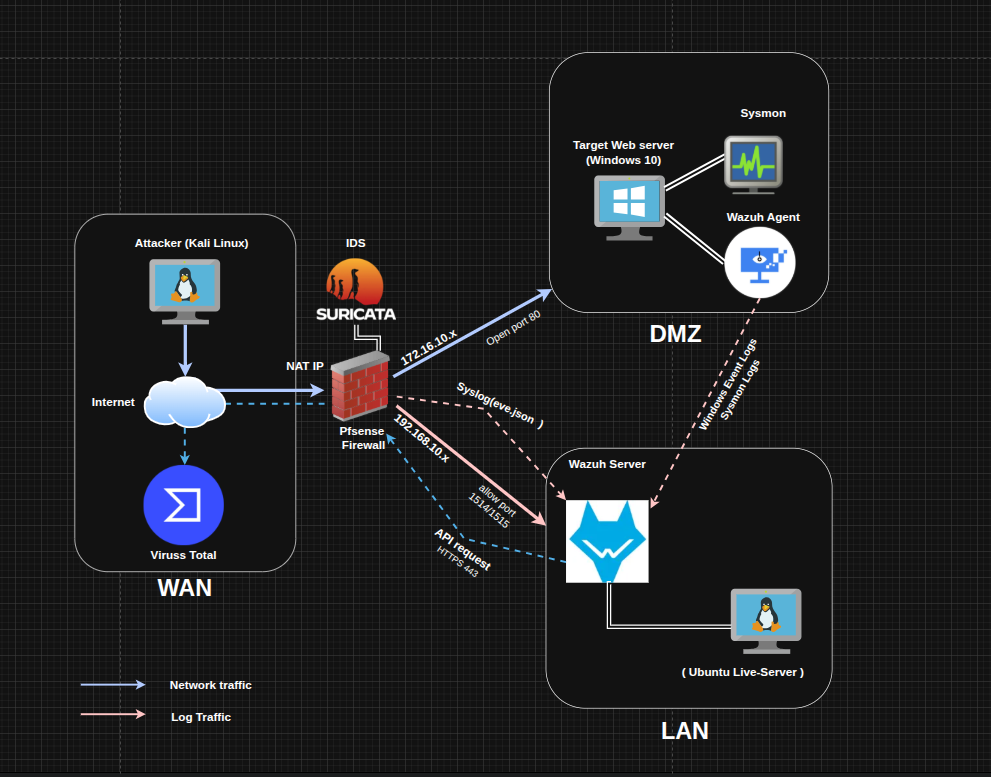

# Triển khai mô hình SOC Mini: Giám sát, Cô lập DMZ và Phản ứng tự động với Wazuh & pfSense.

## Component Roles

- **Kali linux:** Đóng vai trò làm kẻ tấn công, đưa ra các kịch bản tấn công vào máy chủ Windows.
- **pfSense (Firewall):** Đóng vai trò như một gateway, đồng thời cũng là một lá chắn giúp kiểm soát truy nhập từ mạng Internet vào trong mạng nội bộ.
- **Suricata (NIDS):** Được tích hợp chạy trên pfSense, có chức năng kiểm tra dữ liệu của gói tin nhằm phát hiện các dấu hiệu tấn công của kẻ thù.
- **Wazuh Manager (SIEM core):** Thu thập, lưu trữ log tập trung và đối chiếu với tập luật để đưa ra cảnh báo (custom rules).
- **Window 10:** Workstation / Webserver, đóng vai trò là nạn nhân của các cuộc tấn công mạng.
- **Sysmon:** 1 dịch vụ hệ thống của Windows, được cài đặt thêm nhằm thu thập logs hệ thống (chi tiết hơn Windows Event Logs).

## IP Schema

- **WAN Zone:** Chế độ NAT (nhận IP tự động từ VM Ware)
- **LAN Zone:** Chế độ Host Only / Internal.

&nbsp;