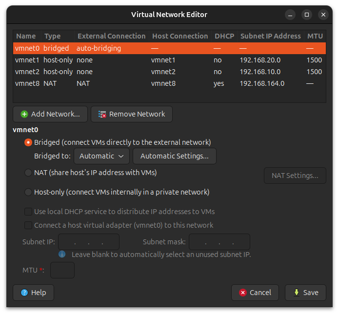
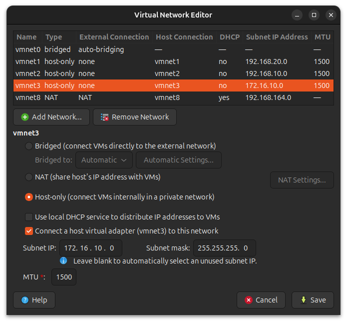
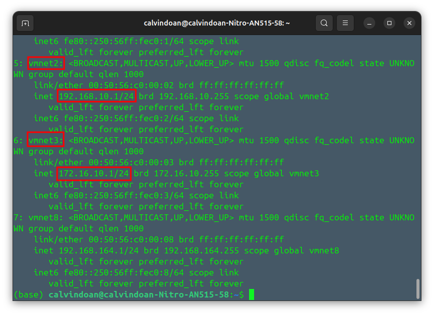

| **Tên Thiết bị (Máy ảo)** | **Vai trò trong mô hình** | **Cấu hình Network Adapter** | **IP dự kiến (Subnet)** |
| --- | --- | --- | --- |
| **1\. Kali Linux** | Kẻ tấn công (Red Team) | **NAT** | DHCP từ VMware (Dải mạng NAT) |
| **2\. pfSense** | Tường lửa (Gateway) | **Card 1 (WAN): NAT**  <br>**Card 2 (LAN): Custom (VMnet2)**  <br><br/>**Card 3 (DMZ) : Custom (VMnet3)** | WAN: DHCP từ VMware  <br>LAN: Tĩnh (192.168.10.1)  <br><br/>DMZ: Tĩnh (172.16.10.1) |
| **3\. Ubuntu (Wazuh)** | Máy chủ giám sát (SIEM) | **Custom (VMnet2)** | Tĩnh hoặc DHCP từ pfSense (192.168.10.x) |
| **4\. Windows 10** | Nạn nhân (Endpoint) | **Custom (VMnet3)** | DHCP từ pfSense (172.16.10.x) |

&nbsp;

**1\. Máy tấn công: Kali Linux (Chỉ dùng NAT)**

- **Lý do:** Ở chế độ NAT, Kali Linux đóng vai trò là một tác nhân nguy hiểm nằm ngoài Internet (Public Network - Untrusted area).
    
- **Mục đích:**
    
    - Cần có kết nối Internet để tải các công cụ Hacking (như Metasploit, Nmap) .
        
    - Kẻ tấn công không thể nhìn thấy trực tiếp mạng nội bộ (VMnet2). Nếu Kali muốn tấn công Windows 10, nó bắt buộc phải dò quét và đi qua cổng mặt ngoài (Cổng WAN) của bức tường lửa pfSense.
        

**2\. Tường lửa pfSense (Dùng cả NAT và VMnet2)**

- **Card 1 (NAT - WAN):** Đây là "Cửa trước" của hệ thống hướng ra bên ngoài Internet. Cổng này hứng mạng Internet từ máy tính thật (Host) đẩy vào để chia cho mạng nội bộ. Đồng thời, nó là nơi trực tiếp hứng chịu các đòn rà quét cổng từ máy Kali của kẻ thù.
    
- **Card 2 (VMnet2 - LAN):** Đây là "Cửa sau" mở vào vùng nội bộ an toàn. Cổng này đóng vai trò là Default Gateway (Router) và là máy chủ cấp phát IP (DHCP Server) cho toàn bộ các máy nằm trong dải `192.168.10.0/24`.
    
- **Card 3 (Vmnet3 - DMZ):** Đây là nơi sẽ triển khai dịch vụ web server cho phép giao tiếp với mạng internet (dải IP `172.16.10.0/24`).
    

**3\. Vùng an toàn: Ubuntu (Wazuh Server)**

- **Lý do:** máy chủ ghi log đều được quy hoạch vào một mạng LAN (VMnet2), mô phỏng cho mô hình mạng LAN trong doanh nghiệp.
    
- **Mục đích:**
    
    - **Bảo mật:** Không một ai từ ngoài Internet có thể chọc thẳng vào cổng SSH của Ubuntu hay cổng RDP của Windows. Mọi truy cập phải đi qua sự kiểm duyệt của luật tường lửa (Firewall Rules) trên pfSense.
        
    - **Giao tiếp nội bộ:**  máy Windows 10 sử dụng Wazuh Agent để có thể liên tục đẩy log sự kiện (Sysmon logs & Windows Event Logs) về cho máy chủ Ubuntu (Wazuh Manager) một cách mượt mà thông qua địa chỉ IP LAN mà không cần vòng ra Internet.
        

**4\. Vùng quân sự: Windows (Web server)**

# Cấu hình Custom Network cho mạng LAN

Mặc định khi cài đặt, VMware chỉ tạo sẵn đúng 3 cái Switch:

- `/dev/vmnet0` (Bridged)
    
- `/dev/vmnet1` (Host-only)
    
- `/dev/vmnet8` (NAT)
    

**Các bước tạo nhanh mạng VMnet2 trên hệ điều hành Linux:**

**Bước 1:** Mở công cụ Virtual Network Editor bằng cách bật terminal và nhập lệnh `sudo vmware-netcfg`

**Bước 2: Thêm mạng mới (Add Network)**

- Ở góc dưới bên trái của bảng, bạn bấm vào nút **`Add Network...`**
    
- Xổ menu xuống và chọn **`vmnet2`**, sau đó bấm Add/OK.
    

**Bước 3: Cấu hình an toàn cho VMnet2 (Cực kỳ quan trọng)** Bây giờ cái `vmnet2` đã xuất hiện trong danh sách. Bạn click chọn nó và nhìn xuống nửa dưới của bảng để cấu hình:

1.  Chọn tùy chọn: **`Host-only`**.
    
2.  **BỎ TÍCH** ở ô: **`Use local DHCP service to distribute IP address to VMs`**. (Chúng ta phải tắt cái này đi để nhường quyền cấp IP lại cho con tường lửa pfSense, tránh xung đột mạng).
    
3.  Bấm **`Save`** hoặc **`Apply`** để lưu lại.
    



Tương tự như vậy với **VMnet3**



Thay đổi cấu hình địa chỉ mặc định do vmware cấp cho host để tránh trùng với địa chỉ thiết lập default gateway trên pfsense firewall.



mở terminal trên host và chạy lệnh:

### 1\. Thay đổi tạm thời (chỉ lưu vào ram - reset khi reboot)

thay đổi vmnet 2: `sudo ip addr flush dev vmnet2 && sudo ip addr add 192.168.10.5/24 dev vmnet2`

thay đổi vmnet3: `sudo ip addr flush dev vmnet3 && sudo ip addr add 172.16.10.5/24 dev vmnet3`

### 2\. Thay đổi cứng (lưu vào ổ cứng)

**Bước 1**: Mở file cấu hình Netplan `ls /etc/netplan/`

(Thường nó sẽ có tên là `01-network-manager-all.yaml` hoặc `00-installer-config.yaml`).

`sudo nano /etc/netplan/01-network-manager-all.yaml`

**Bước 2:** Viết cấu hình cho vmnet2 và vmnet3

Bạn di chuyển con trỏ xuống dưới cùng và thêm đoạn cấu hình cho 2 card ảo này vào. Hãy **dùng phím Space (dấu cách) để lùi đầu dòng**, tuyệt đối không dùng phím Tab:

```
network:
  version: 2
  renderer: NetworkManager
  ethernets:
    vmnet2:
      addresses:
        - 192.168.10.100/24
      dhcp4: false
    vmnet3:
      addresses:
        - 172.16.10.100/24
      dhcp4: false
```

**Bước 3: Lưu và áp dụng**

1.  Nhấn `Ctrl + X` -> `Y` (Để lưu).
    
2.  Nhấn `Enter` (Để thoát).
    
3.  Gõ lệnh: `sudo netplan apply`
    

&nbsp;