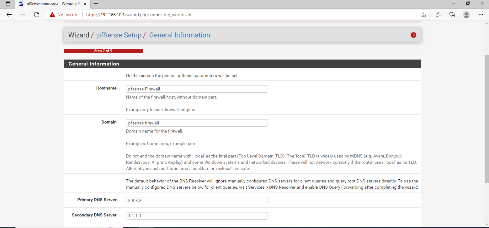
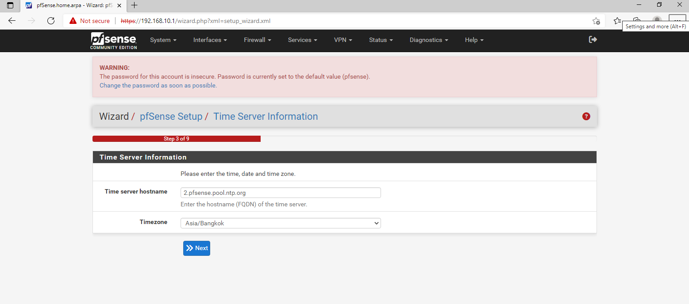
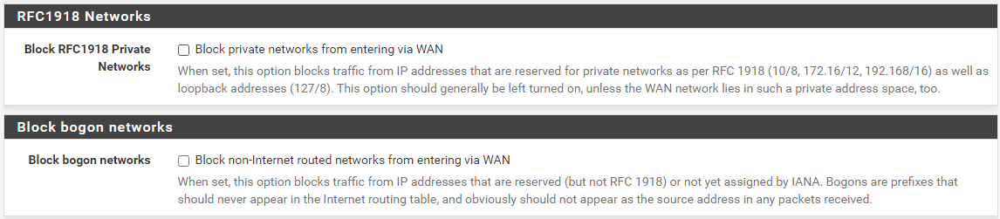
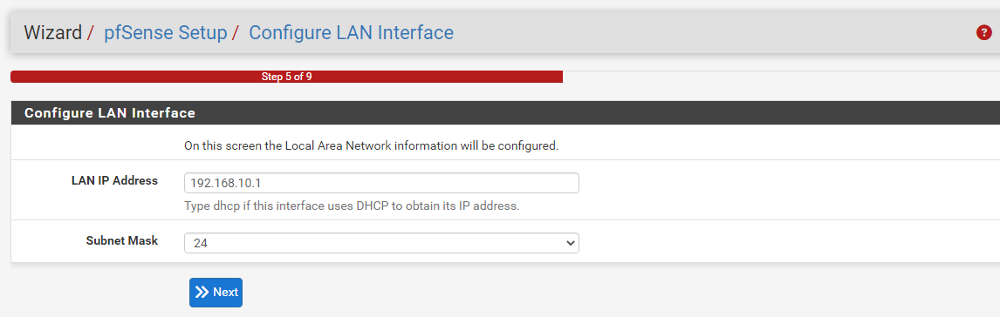
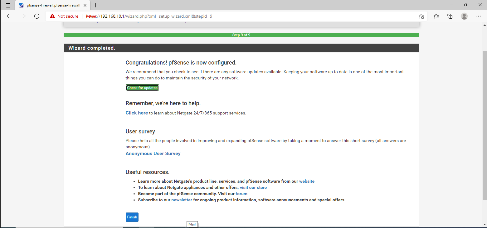
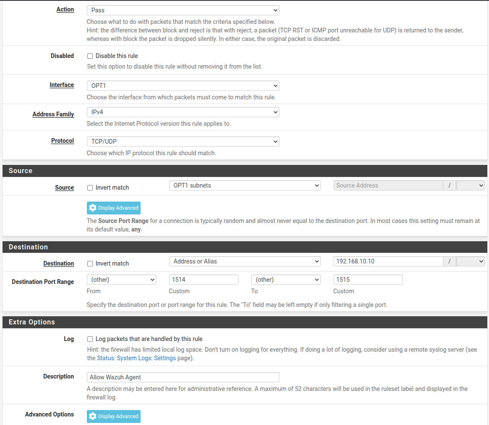
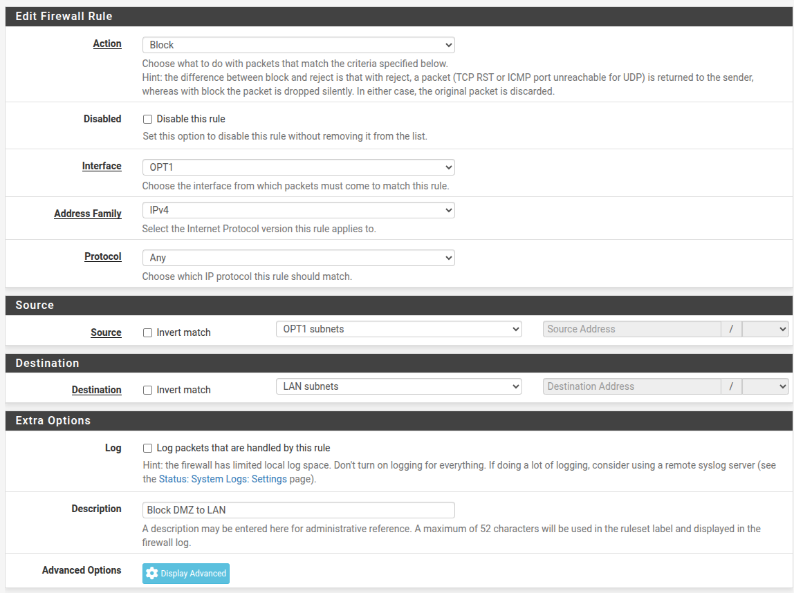
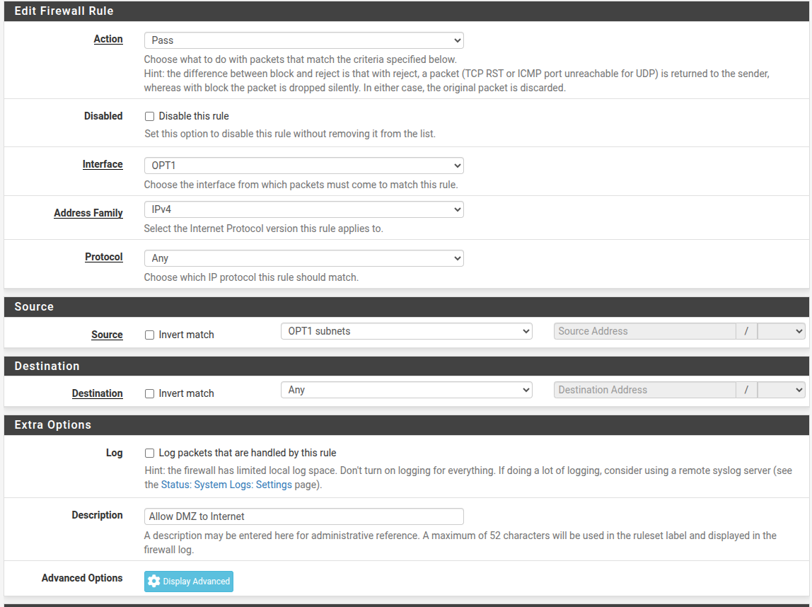
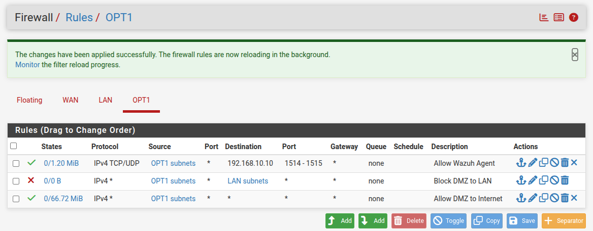

## Sau khi đã cài đặt xog máy ảo pfsense

### 🚀 Giai đoạn 2: Cấu hình pfSense qua Console

**Bước 1: Bật máy ảo pfSense lên.**

1.  Khoa nhấn nút Play (Start up this guest operating system).
    
2.  Chờ nó chạy xong đống chữ trắng trên nền đen. Khi nào nó hiện ra **Menu gồm các số từ 0 đến 16**, thì chuyển sang Bước 2.
    

**Bước 2: Gán cổng mạng (Assign Interfaces)**

1.  Tại Menu chính, Khoa gõ phím **`1`** (Assign Interfaces) rồi nhấn Enter.
    
2.  Hệ thống hỏi `Should VLANs be set up now?` -> Gõ **`n`** rồi Enter.
    
3.  Nó sẽ liệt kê 3 tên card mạng (thường là `em0`, `em1`, `em2` hoặc `le0`, `le1`, `le2`).
    
4.  Nó hỏi `Enter the WAN interface name` -> Bạn gõ tên card mạng đầu tiên (ví dụ **`em0`**) -> Enter.
    
5.  Nó hỏi `Enter the LAN interface name` -> Bạn gõ tên card mạng thứ hai (ví dụ **`em1`**) -> Enter.
    
6.  Nó hỏi `Enter the Optional 1 interface name` (Đây chính là DMZ) -> Bạn gõ tên card mạng thứ ba (ví dụ **`em2`**) -> Enter.
    
7.  Nó hỏi lại thông tin vừa nhập, bạn gõ **`y`** để xác nhận lưu.
    

**Bước 3: Đặt địa chỉ IP tĩnh cho từng cổng** Khi đã quay lại Menu chính, bạn gõ phím **`2`** (Set interface(s) IP address).

- **👉 Đặt IP cho LAN (vmnet2):**
    
    1.  Chọn số tương ứng với **LAN** (Thường là phím số `2`).
        
    2.  `Configure IPv4 address LAN interface via DHCP?` -> Gõ **`n`**.
        
    3.  `Enter the new LAN IPv4 address` -> Gõ **`192.168.10.1`** (Vì bạn đang giữ dải cũ cho Wazuh).
        
    4.  `Enter the new LAN IPv4 subnet bit count` -> Gõ **`24`**.
        
    5.  `For a WAN, enter the new LAN IPv4 upstream gateway address` -> **Nhấn Enter luôn** (bỏ trống).
        
    6.  Các câu hỏi về IPv6 Khoa cứ nhấn Enter bỏ qua.
        
    7.  `Do you want to enable the DHCP server on LAN?` -> Gõ **`y`**, nhập dải từ `192.168.10.100` đến `192.168.10.200` (Để lỡ máy ảo khác cần IP).
        
    8.  `Do you want to revert to HTTP as the webConfigurator protocol?` -> Gõ **`n`**.
        
- **👉 Đặt IP cho DMZ (OPT1 - vmnet3):**
    
    1.  Ở Menu chính, gõ lại phím **`2`**.
        
    2.  Chọn số tương ứng với cổng **OPT1** (Thường là phím số `3`).
        
    3.  `Configure IPv4 address OPT1 interface via DHCP?` -> Gõ **`n`**.
        
    4.  `Enter the new OPT1 IPv4 address` -> Gõ **`172.16.10.1`**.
        
    5.  `Enter the new OPT1 IPv4 subnet bit count` -> Gõ **`24`**.
        
    6.  Bỏ trống IPv4 Gateway và IPv6 như trên.
        
    7.  `Do you want to enable the DHCP server on OPT1?` -> Gõ **`y`**, nhập dải từ `172.16.10.100` đến `172.16.10.200`.
        

## Bật pfSense Firewall rồi mở Windows Host, truy cập vào Internet rồi Search : `https://192.168.10.1` sẽ hiện ra trang web để cấu hình firewall

## **Thiết lập Timezone** và đảm bảo các thiết bị khác cũng có cùng TimeZone này.

### \--> Bấm Next

## **Tiếp theo tới phần Setup cho WAN Interface**

bỏ tích 2 ô này:

**Lý do:**

- **Block private networks:** Chặn tất cả các địa chỉ IP thuộc dải nội bộ (như `10.x.x.x`, `172.16.x.x`, `192.168.x.x`) đi vào cổng WAN.
    
    - *Thực tế:* Trên Internet thật, không bao giờ có chuyện một gói tin từ dải IP nội bộ lại "lạc" vào cổng WAN của bạn, trừ khi đó là một cuộc tấn công giả mạo (Spoofing). Nên pfSense mặc định chặn để bảo mật.
- **Block bogon networks:** Chặn các IP "ma" (chưa được đăng ký hoặc không tồn tại trên bản đồ Internet thế giới).
    

Tuy nhiên để thuận tiện cho việc thử nghiệm, giả sử như các điều trên sẽ mặc định được thỏa mãn. --> **Bấm Next**

# **ConFigure LAN Interface**

`192.168.10.1`là default Gateway

Chúng ta sử dụng mặt nạ mạng 24, có nghĩa **IP network** là: `192.168.10.0/24`

Tiếp tục bấm Next cho tới đây là đã hoàn thành.

# Setup rules cho vùng DMZ

`Firewall --> Rule --> OTP1`

## 🧱 Setup 3 Rule cho vùng DMZ (Theo thứ tự Top-Down)

#### 🟢 Rule 1: Mở đường cho Wazuh (Nằm trên cùng)

1.  Nhấn nút **Add** (nút có mũi tên hướng lên ⬆️).
    
2.  **Action:** Pass
    
3.  **Interface:** OPT1
    
4.  **Address Family:** IPv4
    
5.  **Protocol:** TCP/UDP
    
6.  **Source:** Chọn `OPT1 subnets`
    
7.  **Destination:** Chọn `Address or alias` -> Gõ ô bên cạnh: **`192.168.10.10`** (IP Ubuntu).
    
8.  **Destination Port Range:**
    
    - Từ (From): `(other)` -> Gõ **`1514`**
        
    - Đến (To): `(other)` -> Gõ **`1515`**
        
9.  **Description:** Gõ "Allow Wazuh Agent" (để sau này dễ nhớ).
    
10. Nhấn **Save**.
    
    - 

#### 🔴 Rule 2: Cấm DMZ "leo rào" vào LAN (Nằm giữa)

1.  Nhấn nút **Add** (nút có mũi tên hướng xuống ⬇️, để nó xếp dưới Rule 1).
    
2.  **Action:** **Block.**
    
3.  **Interface:** OPT1
    
4.  **Address Family:** IPv4
    
5.  **Protocol:** Any
    
6.  **Source:** Chọn `OPT1 subnets`
    
7.  **Destination:** Chọn `Network` -> Gõ ô bên cạnh: **`192.168.10.0`** / chọn **`24`** ở ô nhỏ (Hoặc nếu mục Destination có thả xuống chọn được `LAN subnets` thì chọn luôn).
    
8.  **Description:** Gõ "Block DMZ to LAN".
    
9.  Nhấn **Save**.
    
    - 

#### 🟢 Rule 3: Cho phép máy Windows lướt Web (Nằm dưới cùng)

1.  Nhấn nút **Add** (nút có mũi tên hướng xuống ⬇️, để nó xếp dưới Rule 2).
    
2.  **Action:** Pass
    
3.  **Interface:** OPT1
    
4.  **Address Family:** IPv4
    
5.  **Protocol:** Any
    
6.  **Source:** Chọn `OPT1 subnets`
    
7.  **Destination:** Any
    
8.  **Description:** Gõ "Allow DMZ to Internet".
    
9.  Nhấn **Save**.
    
    - 

## Kết quả

- 

&nbsp;

# Configure rule cho vùng WAN