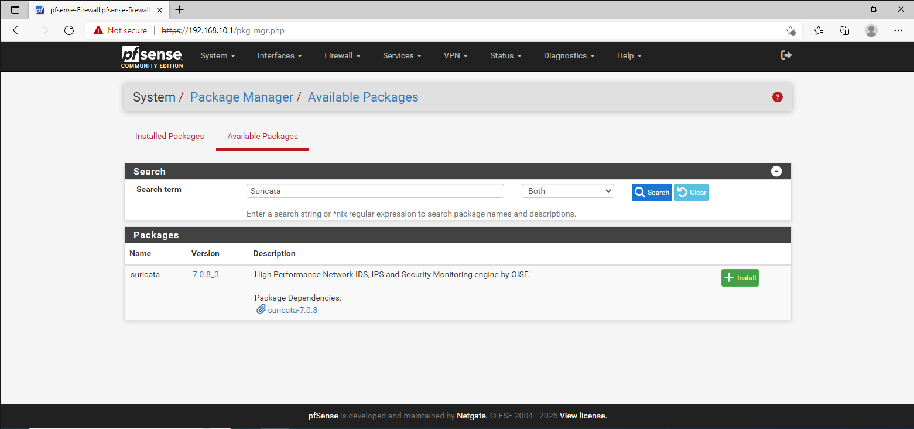
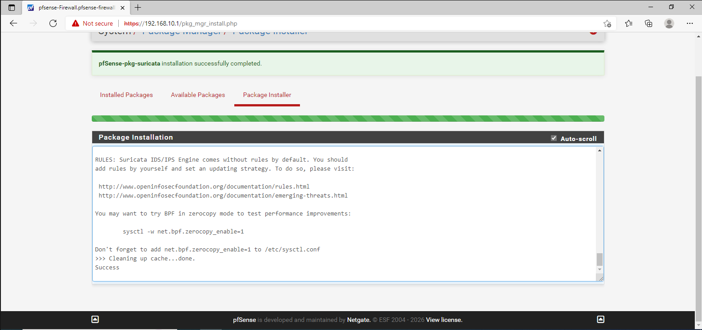
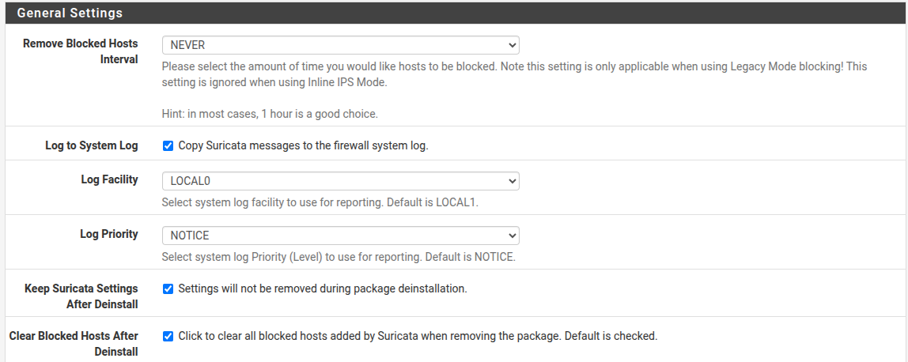
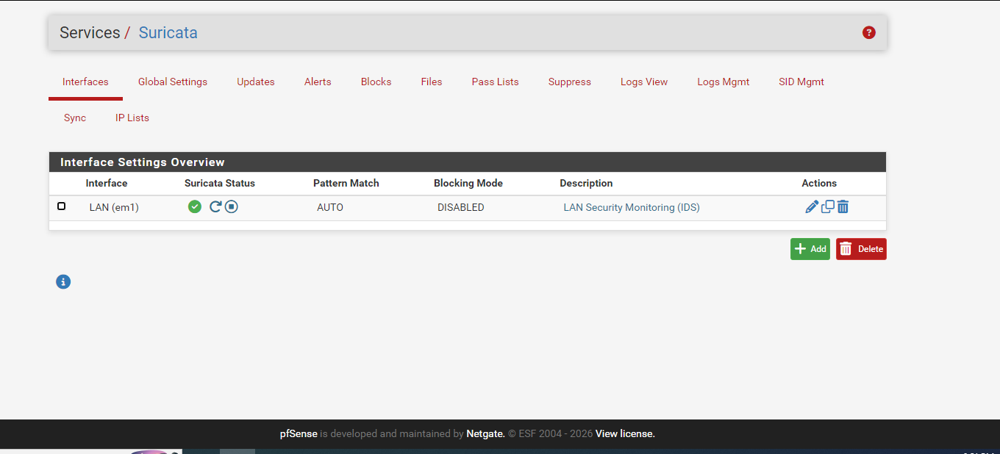
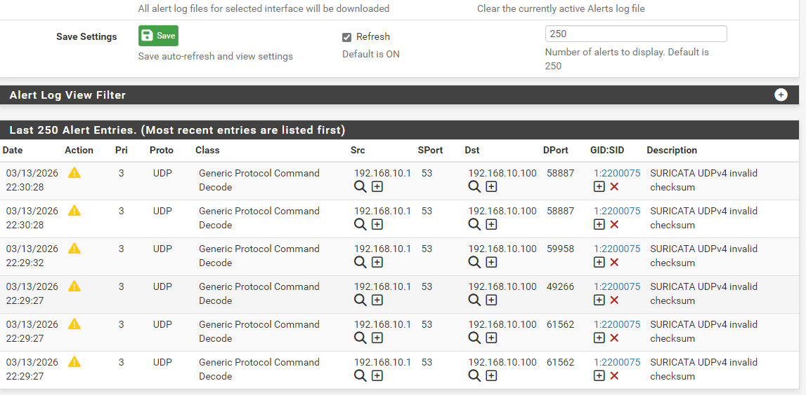

**Vị trí:** Ngay trên giao diện Web của pfSense (Windows 10).

**Cách làm:** Vào **System** ➡️ **Package Manager** ➡️ **Available Packages** ➡️ Tìm **Suricata** ➡️ **Install**.



Bấm Install và chờ cho tới chi Suricata được cài đặt xog.

****

Đến đây, tạm thời chúng ta đã hoàn thành việc cấu hình Suricata. Tuy nhiên, sẽ chưa có luật nào được áp dụng cho tới khi chung ta cấu hình cho nó.

### 🛠️ Việc cần làm để Suricata bắt đầu hoạt động:

**Bước 1: Tải Global Rules**

1.  Trên menu chính của pfSense, vào **Services** ➡️ **Suricata**.
    
2.  Chọn tab **Global Settings**.
    
3.  Kéo xuống mục **Install ETOpen Free Emerging Threats rules**, tích vào ô **`Enable`**.
    
4.  Bạn có thể tích thêm **`Enable Snort VRT`** nếu có code, nhưng tạm thời cứ dùng **ETOpen** là đủ rồi.
    
5.  Kéo xuống dưới cùng bấm **Save**.
    

**Bước 2: Cập nhật Rules**

1.  Chuyển sang tab **Updates**.
    
2.  Bấm vào nút **`Update`**. Đợi một lát để nó tải hàng nghìn luật nhận diện mã độc về máy. Khi nào dòng *Status* báo "Success" là xong.
    

**Bước 3: Chọn cổng mạng để canh gác**

1.  Chuyển sang tab **Interfaces**.
    
2.  Bấm nút **`Add`.**
    
3.  Ở mục **Interface**, chọn **LAN** (để giám sát lưu lượng đi vào mạng nội bộ).
    
4.  Ở mục **Description**, ghi: `LAN Security Monitoring`.
    
5.  Tích chọn thêm ô `Send Alerts to System Log`
    
    - 
    - **Log Facility (LOCAL0):** Đây là kênh để Suricata đẩy log vào hệ thống FreeBSD của pfSense.
    - **Log Priority (NOTICE):** Mức độ ưu tiên này giúp lọc các thông báo. `NOTICE` là mức vừa phải, đủ để ghi lại các sự kiện quan trọng mà không làm rác file log.
6.  Bấm **Save**.
    



Đến đây là hoàn thành việc cài đặt Suricata.

## Testing

Máy chủ kali thực hiện lệnh : `nmap -sV 192.168.10.1`

Kết quả trên suricata:



&nbsp;

# 🛠️ Cách cấu hình Linux tự động cấp quyền Promiscuous Mode khi khởi động:

Để làm điều này, chúng ta sẽ tạo một "kịch bản" nhỏ (script) để Linux tự động chạy lệnh `chmod a+rw /dev/vmnet*` mỗi khi hệ thống khởi động lên.

**Bước 1: Tạo file cấu hình (Service) mới** Gõ lệnh này để tạo và mở một file service mới tên là `vmware-promiscuous.service`:

```
sudo nano /etc/systemd/system/vmware-promiscuous.service
```

**Bước 2: Viết "kịch bản" tự động** Khi màn hình Nano hiện ra,  copy và paste đoạn code sau vào:

```
[Unit]
Description=Enable VMware Promiscuous Mode
After=vmware.service

[Service]
Type=oneshot
ExecStart=/bin/sh -c '/bin/chmod a+rw /dev/vmnet*'
RemainAfterExit=yes

[Install]
WantedBy=multi-user.target
```

- Nhấn `Ctrl + O`, sau đó nhấn `Enter` để lưu file.
    
- Nhấn `Ctrl + X` để thoát khỏi Nano.
    

**Bước 3: Kích hoạt Service để nó chạy cùng hệ thống** Gõ 2 lệnh này để "nạp" kịch bản vào hệ thống và cho phép nó tự động chạy khi bật máy:

```
sudo systemctl daemon-reload
sudo systemctl enable vmware-promiscuous.service
```

*(Nếu nó báo `Created symlink...` là thành công).*

**Bước 4: Chạy thử Service ngay lúc này** Gõ lệnh này để hệ thống thực thi ngay lập tức cái script bạn vừa viết (để xem nó có lỗi gì không):

```
sudo systemctl start vmware-promiscuous.service
```

**Bước 5:** Kiểm tra

```
sudo systemctl start vmware-promiscuous.service
```