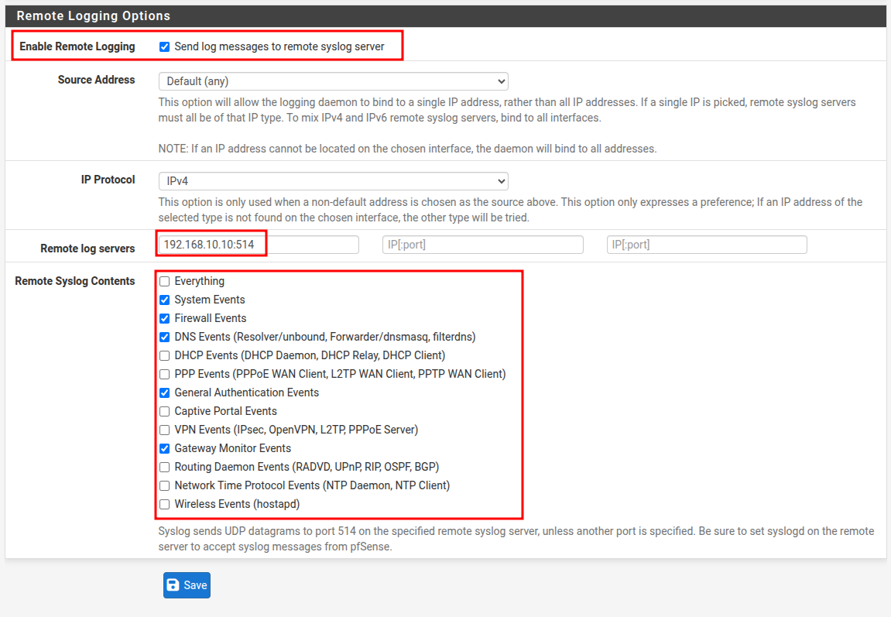
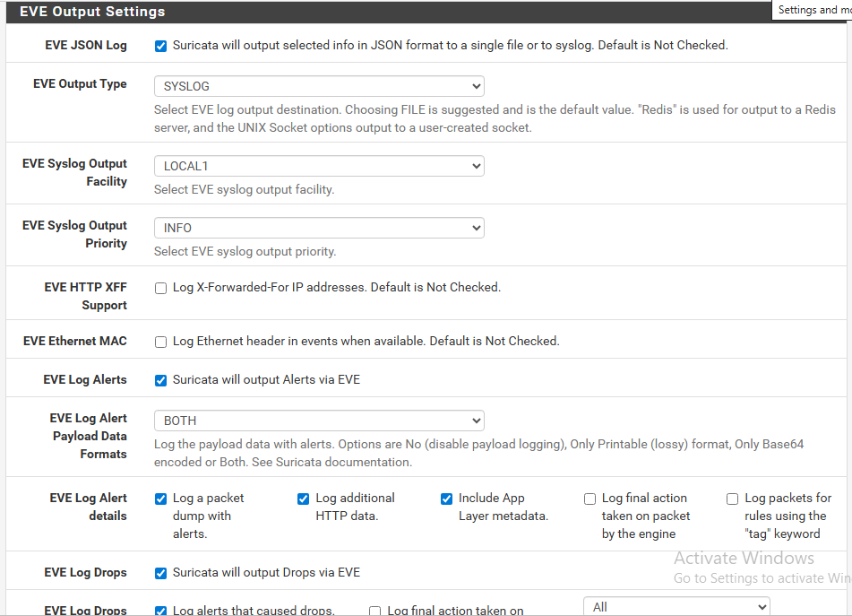

# Phần 1: Đẩy Log Firewall từ pfSense về Wazuh

**Bước 1: Cấu hình cho phép Pfsense chuyển tiếp logs qua Wazuh:**

1.  Vào menu **Status** -> **System Logs** -> Chọn tab **Settings** ở góc phải.
    
2.  Cuộn xuống dưới cùng tìm mục **Remote Logging Options**.
    
3.  Tích vào ô **Enable Remote Logging**.
    
4.  Ở ô **Remote log servers** `192.168.10.10:514`
    
5.  Ở phần **Remote Syslog Contents,** chọn các loại logs cần thiết để giám sát:
    
    - 
6.  Nhấn **Save**.
    

&nbsp;

# Phần 2: Cấu hình Suricata đẩy log vào Syslog

Để log của Suricata đi chung luồng với log hệ thống pfSense về Wazuh:

1.  Vào **Services** > **Suricata** > Tab **Interfaces**.
    
2.  Nhấn nút **Edit** (hình bút chì) tại interface mà bạn đang chạy Suricata (thường là WAN hoặc DMZ).
    
3.  Tìm mục **EVE Log Settings**:
    
    - **EVE Output**: Tích chọn.
        
    - **EVE Log To System Log**: Tích chọn (Đây là dòng quan trọng nhất để đẩy cảnh báo IDS vào Syslog).
        
    - 
4.  Nhấn **Save** và **Restart Suricata** trên interface đó.
    

&nbsp;