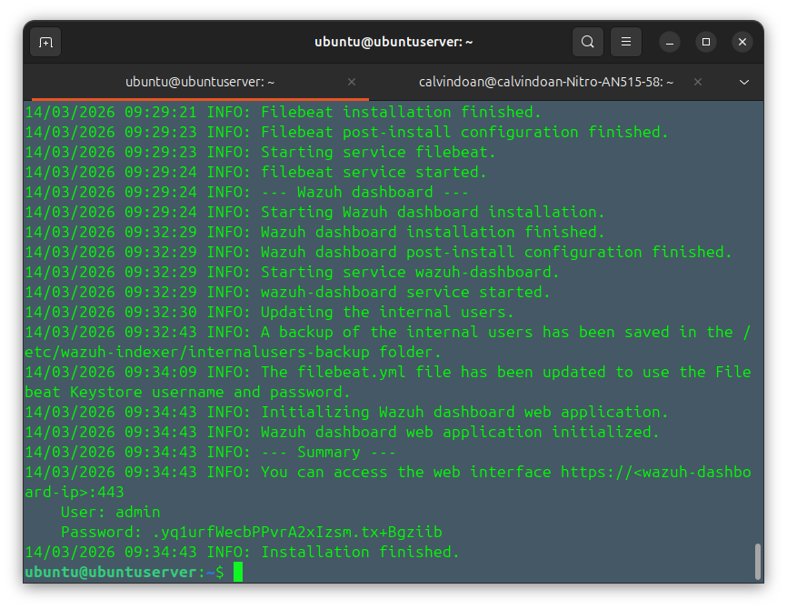
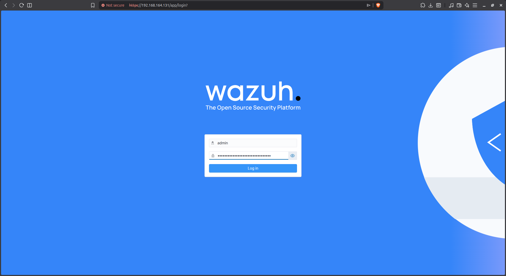

Thực hiện tải Wazuh Manager trên máy chủ Ubuntu Server

`curl -o wazuh-install.sh https://packages.wazuh.com/4.14/wazuh-install.sh && sudo bash wazuh-install.sh -a`

truy cập vào trang chủ wazuh và bắt đầu cấu hình

## Thay đổi pass của Admin

login root:

`sudo su`

`cd /usr/share/wazuh-indexer/plugins/opensearch-security/tools/`

Thay đổi mặt khẩu của tài khoản admin:

`./wazuh-passwords-tool.sh -u admin -p yourpassword`