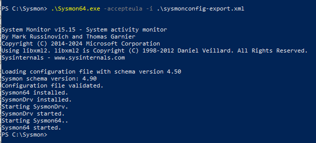
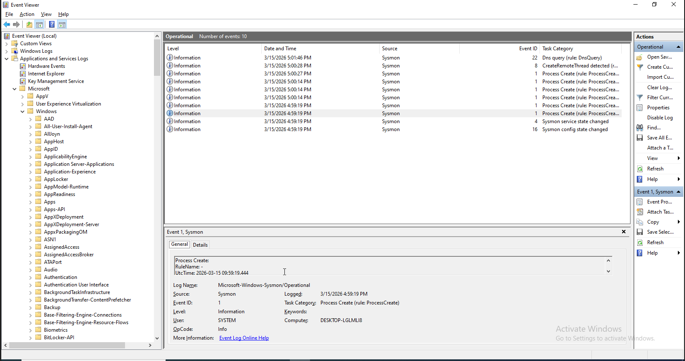
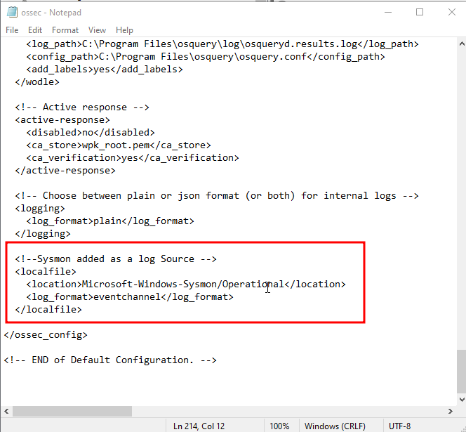

**Bước 1: Tải và cài đặt Sysmon trên máy Windows**

1.  **Tải Sysmon:** Vào máy Windows 10, mở trình duyệt và tải Sysmon trực tiếp từ Microsoft Sysinternals: [https://download.sysinternals.com/files/Sysmon.zip](https://www.google.com/search?q=https://download.sysinternals.com/files/Sysmon.zip)
    
    - Giải nén (Extract All), đặt đường dẫn là **C:\\Sysmon** để dễ quản lí.
2.  Tải một file cấu hình mẫu chuẩn (giúp lọc bớt log rác), mình khuyên dùng bộ của **SwiftOnSecurity**: [sysmonconfig-export.xml](https://www.google.com/search?q=https://github.com/SwiftOnSecurity/sysmon-config/blob/master/sysmonconfig-export.xml).
    
    - Tải file cấu hình Sysmon từ GitHub:
    - mở **PowerShell (Admin)** trên máy Windows 10
        - ```powershell
              # Di chuyển vào thư mục C:\Sysmon vừa tạo
              cd C:\Sysmon
                      
              # Tải file cấu hình từ GitHub của SwiftOnSecurity
              Invoke-WebRequest -Uri "https://raw.githubusercontent.com/SwiftOnSecurity/sysmon-config/master/sysmonconfig-export.xml" -OutFile "sysmonconfig-export.xml"
                  
            ```
            
3.  Mở PowerShell (Admin) và chạy lệnh:
    
    PowerShell
    
    ```
    .\Sysmon64.exe -i .\sysmonconfig-export.xml -accept-eula
    ```
    
    
    
4.  Để xem Sysmon logs:
    
    - ```
        Event Viewer --> Applications And Services Logs --> Microsoft --> Windows --> Sysmon
        ```
        
    - 

**Bước 2: Bảo Wazuh Agent hãy "đọc" log của Sysmon**

1.  Mở Notepad (Run as Administrator) --> `Ctrl O`.
    
2.  Mở file cấu hình của Agent: `C:\Program Files (x86)\ossec-agent\ossec.conf`.
    
3.  Thêm đoạn này vào trong mục `<ossec_config>`:
    
    - &nbsp;
        
        ```xml
        <localfile>
          <location>Microsoft-Windows-Sysmon/Operational</location>
          <log_format>eventchannel</log_format>
        </localfile>
        ```
        
    - 
4.  Restart lại service Wazuh bằng lệnh trên Windows `NET STOP Wazuh` và `NET START Wazuh` hoặc `Restart-Service WahzuSvc`.
    
5.  Restart lại Wazuh Manager trên Ubuntu bằng lệnh: `sudo systemctl restart wazuh-manager`
    

&nbsp;