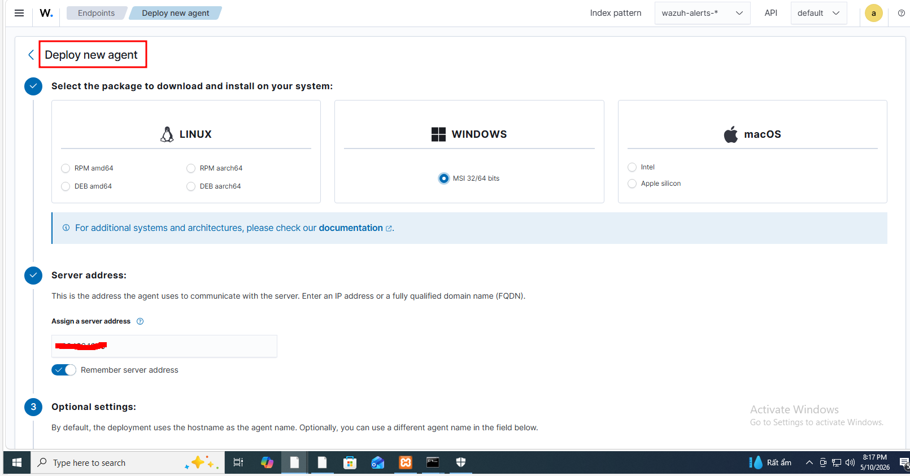

## Triển khai Wazuh Agent cho Windows Web Server

**Bước 1: Cài Agent** Bạn lên giao diện Wazuh, vào mục **Agents -> Deploy new agent**, chọn đúng Hệ điều hành của máy chạy XAMPP, nhập IP của Wazuh Server. Sau đó copy lệnh và dán vào máy XAMPP để cài.

****

**Bước 2: Cấu hình cho Wazuh đọc Log XAMPP** Sau khi cài xong, bạn mở file cấu hình của Agent (`ossec.conf` trên máy XAMPP) và thêm đoạn này vào để nó theo dõi log của Apache:

```
<localfile>
  <log_format>apache</log_format>
  <location>C:\xampp\apache\logs\access.log</location>
</localfile>

<localfile>
  <log_format>apache</log_format>
  <location>C:\xampp\apache\logs\error.log</location>
</localfile>
```

*(Nếu bạn dùng Linux, hãy đổi đường dẫn tới `/opt/lampp/logs/...`)*

**Bước 3: Restart Agent**

`net stop WazuhSvc && net start WazuhSvc`