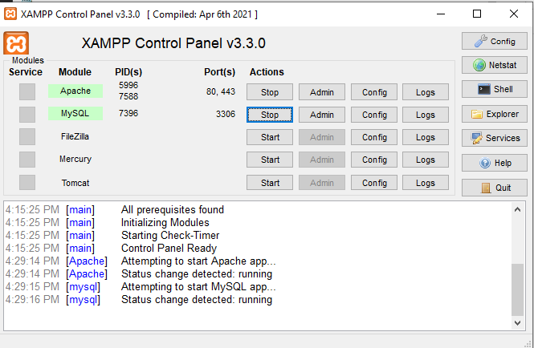
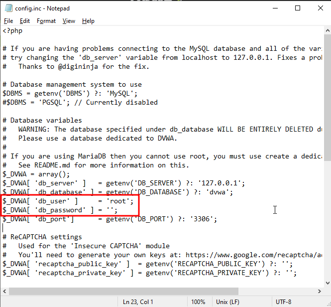
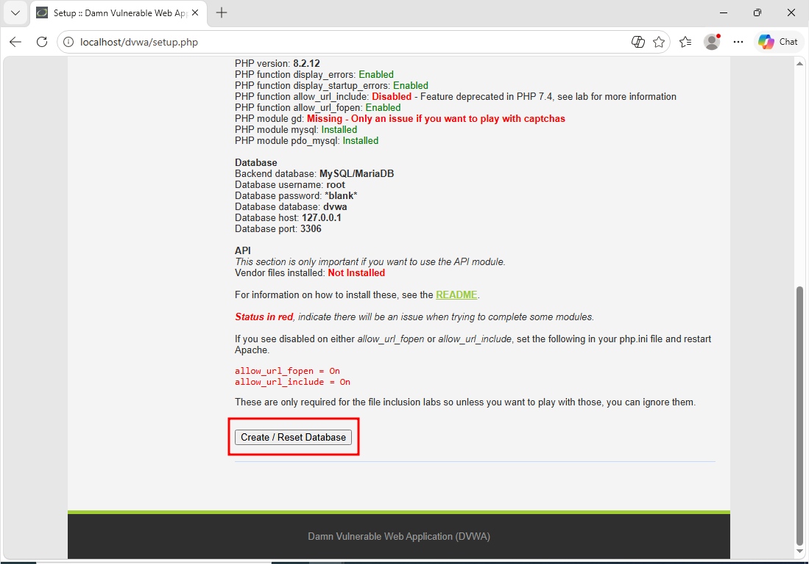
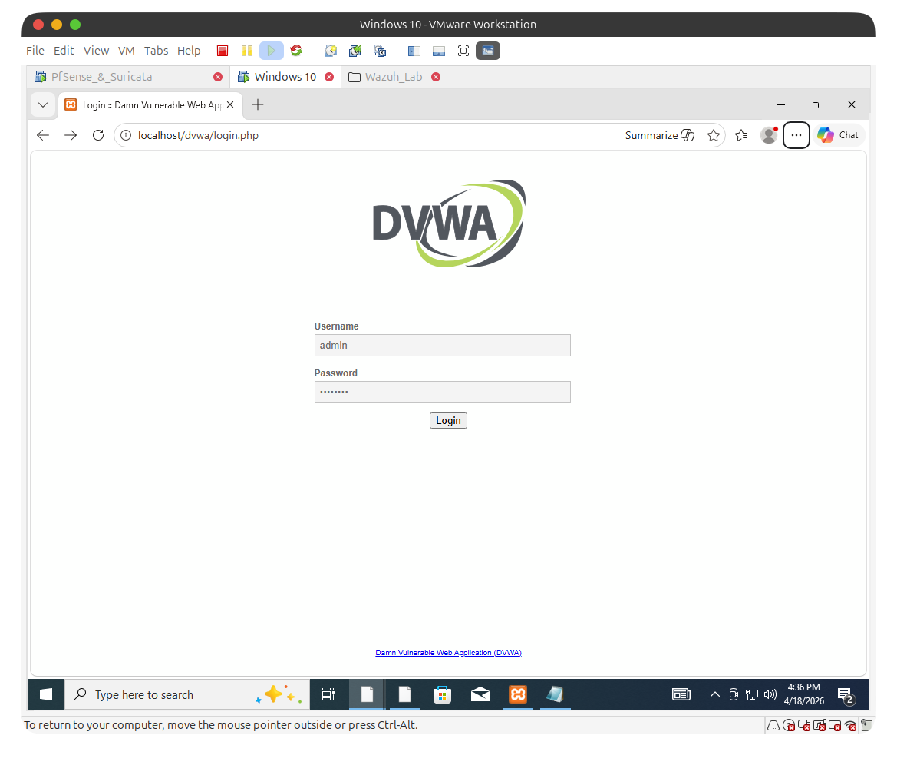

### Bước 1: Cài đặt XAMPP

XAMPP sẽ cung cấp Web Server (Apache) và Database (MySQL) để chạy DVWA.

1.  Mở trình duyệt trên máy ảo Windows, tìm Google chữ "XAMPP" hoặc vào thẳng trang `apachefriends.org` để tải bản XAMPP cho Windows.
    
2.  Cứ bấm **Next** liên tục để cài đặt (nhớ giữ nguyên đường dẫn mặc định là `C:\xampp`).
    
3.  Cài xong, mở cái **XAMPP Control Panel** lên.
    
4.  Bấm nút **Start** ở 2 dòng đầu tiên là **Apache** và **MySQL**. *(Nếu Windows Firewall có hiện lên hỏi, Khoa nhớ bấm Allow access nhé).* Khi 2 chữ này chuyển sang màu xanh lá cây là thành công!
    

### Bước 2: Tải DVWA

1.  Vẫn trên máy ảo Windows, Khoa vào Google gõ "DVWA GitHub" (hoặc vào link `github.com/digininja/DVWA`).
    
2.  Bấm vào nút màu xanh lá **Code** -> Chọn **Download ZIP**.
    
3.  Tải về xong, giải nén cái file ZIP đó ra.
    
4.  Đổi tên cái thư mục vừa giải nén thành một chữ ngắn gọn thôi: **`dvwa`**
    

### Bước 3: Đưa Website lên máy chủ

1.  Khoa copy toàn bộ cái thư mục `dvwa` vừa đổi tên ở Bước 2.
    
2.  Tìm đến đường dẫn: **`C:\xampp\htdocs\`**
    
3.  Paste thư mục `dvwa` vào trong đó. *(Thư mục htdocs chính là nơi chứa các trang web của XAMPP).*
    

### Bước 4: Cấu hình và Kích hoạt

DVWA mặc định giấu file cấu hình, mình phải đổi tên lại cho nó nhận.

1.  Khoa vào thư mục **`C:\xampp\htdocs\dvwa\config`**.
    
2.  Tìm file có tên là `config.inc.php.dist` -> Bấm chuột phải chọn Rename, xóa cái chữ `.dist` ở đuôi đi. File sẽ đổi thành **`config.inc.php`**.
    
3.  Mở file đó lên bằng Notepad. Tìm đến 2 dòng cấu hình Database và sửa lại như sau (để khớp với mật khẩu mặc định của XAMPP):
    
    - `$_DVWA[ 'db_user' ] = 'root';`
        
    - `$_DVWA[ 'db_password' ] = '';` *(Xóa trắng mật khẩu, không để dấu cách ở giữa 2 dấu nháy đơn).*
        
    - Bấm Ctrl + S để lưu lại.
        
    
    
4.  Mở trình duyệt web, gõ vào thanh địa chỉ: **`http://localhost/dvwa/setup.php`**
    
5.  Cuộn xuống dưới cùng, bấm vào nút **Create / Reset Database**.
    
    - 

Sau khi bấm nút, trang web sẽ tự động chuyển hướng ra màn hình đăng nhập. Khoa gõ tài khoản mặc định của DVWA là:

- Username: **admin**
    
- Password: **password**
    
- ****