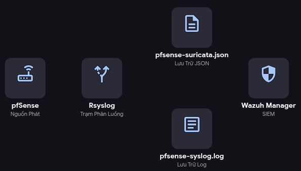
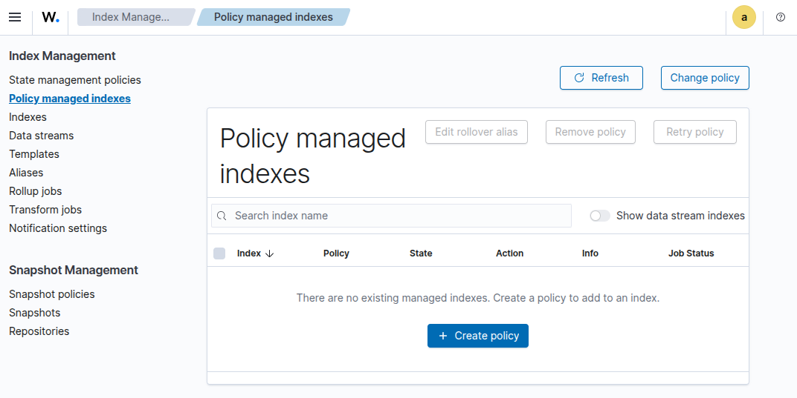

# PHẦN 1: KIẾN TRÚC LOG PIPELINE

## 1\. Tổng quan & Mục tiêu (Overview & Objectives)

Trong môi trường mạng thực tế, Tường lửa (pfSense) sinh ra một lượng log khổng lồ và hỗn tạp bao gồm log hệ thống, log lọc gói tin (Firewall Filter) và log cảnh báo xâm nhập (Suricata IDS).

Nếu đẩy toàn bộ luồng log thô này trực tiếp vào cổng 514 của Wazuh Manager, hệ thống phân tích lõi (Analysis Engine) của Wazuh sẽ bị quá tải do phải liên tục sử dụng các biểu thức chính quy (Regex) phức tạp để phân loại và cắt gọt dữ liệu.

**Mục tiêu của kiến trúc này:**

- **Decoupling (Phân tách trách nhiệm):** Sử dụng `Rsyslog` làm "Trạm trung chuyển & Sơ chế" (Log Router/Forwarder).
    
- **Normalization (Chuẩn hóa):** Tự động lột bỏ các header rác của giao thức Syslog đối với log Suricata để lấy lại lõi định dạng JSON tinh khiết.
    
- **Performance (Tối ưu hiệu năng):** Giúp Wazuh sử dụng thẳng bộ giải mã Native JSON, giảm thiểu tài nguyên CPU và tăng tốc độ cảnh báo (Real-time Alerting).
    

## 2\. Sơ đồ Luồng dữ liệu (Data Flow Architecture)



*Kiến trúc được chia làm 3 chặng rõ rệt:*

1.  **Nguồn phát (Log Generator):** pfSense đóng gói mọi sự kiện (Drop/Pass/IDS Alert) vào chuẩn Syslog RFC 3164 và gửi qua giao thức UDP Port 514.
    
2.  **Trạm phân luồng (Log Router - Rsyslog):** Nhận diện nguồn gốc gói tin.
    
    - *Luồng A (Suricata):* Cắt bỏ phần đầu, xuất ra file JSON.
        
    - *Luồng B (Firewall/OS):* Giữ nguyên vỏ Syslog, xuất ra file Log.
        
3.  **Phân tích lõi (SIEM Ingestion - Wazuh):** Đọc các file cục bộ với định dạng đã khai báo tương ứng (`<log_format>json</log_format>` hoặc `syslog`)
    

## 3\. Cấu hình cốt lõi (Core Configurations)

### 3.1. Cấu hình Trạm phân luồng Rsyslog

- Khỏi tạo logic xử lí và phân luồng: `sudo nano /etc/rsyslog.d/50-pfsense.conf`

```
# 1. Khởi tạo listener
$ModLoad imudp
$UDPServerRun 514

# 2. Khởi tạo Template trích xuất lõi JSON
template(name="PureJSON" type="string" string="%msg:2:$%\n")

# 3. Logic Phân luồng (Log Routing Logic)
if $fromhost-ip == '192.168.10.1' then {

    # Luồng A: Nhận diện Suricata
    if $programname == 'suricata' then {
        action(type="omfile" file="/var/log/pfsense-suricata.json" template="PureJSON")
        stop
    }

    # Luồng B: Nhận diện các log còn lại (Firewall Filter, DNS, OpenVPN...)
    action(type="omfile" file="/var/log/pfsense-syslog.log")
    stop
}
```

- Lưu file và khởi động lại dịch vụ: `sudo systemctl restart rsyslog`

### 3.2. Cấu hình Tiếp nhận Dữ liệu Wazuh

**Mục tiêu:** Chỉ định Wazuh Manager đọc 2 file đã được Rsyslog phân loại với định dạng tương ứng.

1.  Mở cấu hình trung tâm: `sudo nano /var/ossec/etc/ossec.conf`
    
2.  Tìm đến khu vực chứa các thẻ `<localfile>`, thêm block cấu hình sau vào:
    

```
  <localfile>
    <log_format>json</log_format>
    <location>/var/log/pfsense-suricata.json</location>
  </localfile>
  
  <localfile>
    <log_format>syslog</log_format>
    <location>/var/log/pfsense-syslog.log</location>
  </localfile>
```

## 4\. Đánh giá Ưu điểm Kiến trúc

- **Loại bỏ xung đột (Port Conflict):** Chấm dứt tình trạng Rsyslog và Wazuh tranh giành port `514` UDP.
    
- **Tính sẵn sàng cao (High Availability - Local Cache):** Nếu dịch vụ Wazuh Manager bị sập hoặc cần khởi động lại để nạp rule mới, Rsyslog vẫn tiếp tục nhận và ghi log xuống file cứng. Khi Wazuh hoạt động trở lại, nó sẽ đọc tiếp từ vị trí đang dừng, đảm bảo **không mất mát (Zero Data Loss)** bất kỳ cảnh báo tấn công nào.
    
- **Bảo mật hệ thống:** Wazuh Manager không cần mở cổng mạng `<remote>` ra bên ngoài, giảm bề mặt tấn công (Attack Surface).
    

&nbsp;

# PHẦN 2: CẤU HÌNH XÓA LOG ĐỊNH KỲ

### 1\. Cấu hình tự động xóa log trên Wazuh Indexer (Retention Policy)

Đây là nơi chiếm nhiều dung lượng nhất. Bạn nên thiết lập chính sách để tự động xóa các bản ghi cũ (ví dụ: chỉ giữ lại log trong 7 ngày).

1.  Truy cập vào giao diện Web: **Wazuh Dashboard**.
    
2.  Mở menu điều hướng (biểu tượng ☰) -> **Index Management**.
    
3.  Chọn **Policy managed indexes**
    
4.  Nhấn nút **Create Policy**
    
    - ****
5.  ```JSON
    {
        "policy": {
            "description": "Tu dong xoa log sau 7 ngay de tiet kiem bo nho",
            "default_state": "hot",
            "states": [
                {
                    "name": "hot",
                    "actions": [],
                    "transitions": [
                        {
                            "state_name": "delete",
                            "conditions": {
                                "min_index_age": "7d"
                            }
                        }
                    ]
                },
                {
                    "name": "delete",
                    "actions": [
                        {
                            "delete": {}
                        }
                    ],
                    "transitions": []
                }
            ],
            "ism_template": {
                "index_patterns": [
                    "wazuh-alerts-*",
                    "wazuh-archives-*"
                ],
                "priority": 100
            }
        }
    }
    ```
    
6.  Áp dụng chính sách cho các Index hiện có:
    
7.  Chính sách ở Bước 5 thường chỉ có tác dụng với các Index tạo mới từ sau khi lưu. Để dọn dẹp các log đang chiếm dung lượng hiện tại:
    
    1.  Ở menu bên trái, chọn mục Indexes.
        
    2.  Tích chọn các Index có tên dạng `wazuh-alerts-4.x-2026.xx.xx`.
        
    3.  Nhấn vào nút Apply policy (hoặc Change policy tùy phiên bản).
        
    4.  Chọn Policy bạn vừa tạo ở Bước 5 và nhấn Apply.
        

### 2\. Dọn dẹp log lưu trữ tại Wazuh Manager

Mặc định, Wazuh Manager lưu lại các file log thô (archives) và log cảnh báo (alerts) trong thư mục `/var/ossec/logs/`.

#### Xóa thủ công:

Bạn có thể kiểm tra dung lượng bằng lệnh:

```
du -sh /var/ossec/logs/*
```

- **Log lưu trữ hàng ngày:** Nằm trong `/var/ossec/logs/alerts/` và `/var/ossec/logs/archives/`. Chúng được nén theo dạng `.gz`.
    
- Bạn có thể xóa các thư mục năm/tháng cũ không cần thiết bằng lệnh `rm -rf`.
    

#### Cấu hình tự động xóa (Cronjob):

Cách tốt nhất là dùng `crontab` để hệ thống tự xóa các file cũ hơn 15 ngày:

1.  Mở crontab: `sudo crontab -e`
    
2.  Thêm dòng sau vào cuối file:
    
    Bash
    
    ```
    0 0 * * * find /var/ossec/logs/alerts/ -name "*.gz" -mtime +15 -delete
    0 0 * * * find /var/ossec/logs/archives/ -name "*.gz" -mtime +15 -delete
    ```
    

&nbsp;

# Cấu hình xóa tất cả logs

### Bước 1: Xóa giao diện Dashboard (Database Indexer)

Dữ liệu bạn nhìn thấy trên Web thực chất được lưu trong cơ sở dữ liệu (OpenSearch/Wazuh Indexer). Xóa file trên máy chủ không làm mất dữ liệu trên Web.

1.  Truy cập vào giao diện Web **Wazuh Dashboard**.
    
2.  Bấm vào biểu tượng **Menu** ở góc trên bên trái (dấu 3 gạch) \$\\rightarrow\$ Chọn **Wazuh** \$\\rightarrow\$ Kéo xuống dưới cùng chọn **Tools** \$\\rightarrow\$ **Dev Tools**.
    
3.  Trong cửa sổ soạn thảo bên trái, bạn nhập chính xác hai dòng lệnh sau:
    
    ```
    DELETE /wazuh-alerts-*
    DELETE /wazuh-archives-*
    ```
    
4.  Bấm vào biểu tượng **Nút Play (màu xanh lá cây)** ở cạnh mỗi dòng lệnh để chạy.
    
5.  Khung bên phải báo `{"acknowledged": true}` là thành công! Bây giờ bạn quay lại mục Discover, Dashboard đã trống trơn.
    

### Bước 2: Xóa file log vật lý trên Ubuntu Server

Để máy chủ nhẹ nhàng và không lưu lại dấu vết file text, bạn tiến hành dọn dẹp thư mục log gốc.

1.  Mở Terminal của máy ảo **Ubuntu_Wazuh_Server**.
    
2.  Dừng dịch vụ Wazuh lại trước khi xóa để tránh lỗi treo file:
    
    - `sudo systemctl stop wazuh-manager`
3.  Thực hiện lệnh xóa toàn bộ file trong thư mục `alerts` và `archives`:
    
    - `sudo rm -rf /var/ossec/logs/alerts/*`  
        `sudo rm -rf /var/ossec/logs/archives/*`
4.  Khởi động lại dịch vụ Wazuh để nó tự động tạo lại các file log mới tinh:
    
    - `sudo systemctl start wazuh-manager`