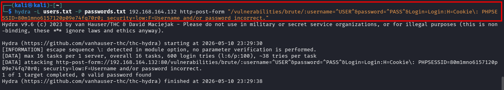
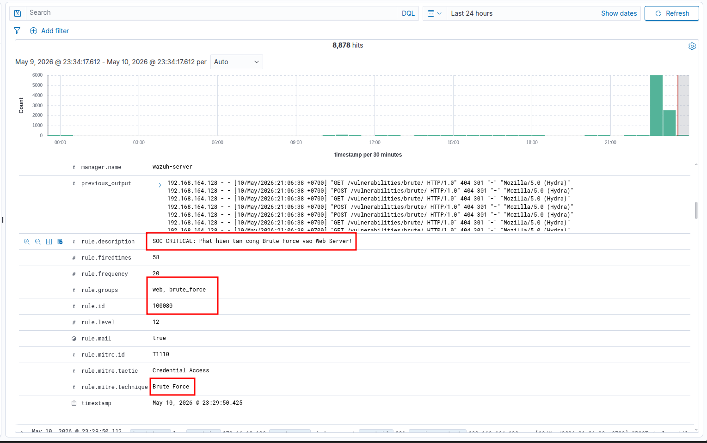

# Kịch bản 1: Rà quét và Tấn công thông tin xác thực (Test mảng 1 - Firewall)

*Mô phỏng việc hacker tìm kiếm lỗ hổng và cố gắng phá mật khẩu cổng quản trị.*

1.  **Hành vi 1: Quét mạng diện rộng (Reconnaissance)**
    
    - **Lệnh Kali Linux:** `nmap -sS -p- -T4 192.168.10.1` *(Lưu ý: Thay IP bằng IP public/WAN của pfSense)*
        
    - **Kết quả kỳ vọng trên Wazuh:** \* Kích hoạt Rule **100100** (Mass Port Scanning).
        
        - Kích hoạt Rule **100101** (Admin port access attempt) khi nmap chạm vào port 22 hoặc 3389.
2.  **Hành vi 2: Brute Force SSH ngay sau khi quét**
    
    - **Lệnh Kali Linux:** `hydra -l root -P /usr/share/wordlists/rockyou.txt ssh://192.168.10.1 -t 4`
        
    - **Kết quả kỳ vọng trên Wazuh:**
        
        - Kích hoạt Rule **100102** (SSH Brute Force).
            
        - **KÍCH HOẠT RULE LIÊN KẾT 100400 (Level 15 - CRITICAL):** Wazuh nhận ra IP này vừa quét mạng (Recon) lại vừa dò mật khẩu (Brute Force) trong vòng 5 phút. Đưa ra báo động đỏ: *Attack chain detected: Recon → Credential attack.*
            

* * *

### Test 3: Brute Force mật khẩu vào trang login của Web Server

1.  Ở máy Kali, dùng công cụ hydra để gửi liên tục post request tới server:
    - 
2.  Kết quả trên Wazuh Dashboard:
    - 

&nbsp;