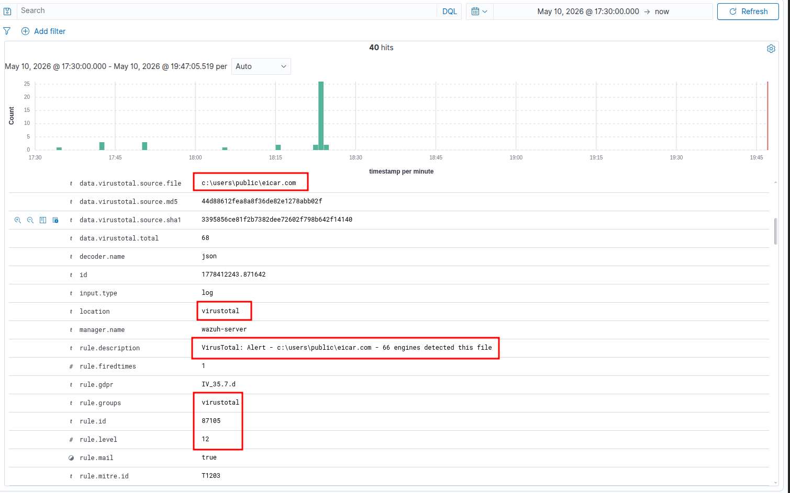

### ⚠️ Lưu ý trước khi Test (Checklist)

Để VirusTotal "nổ" được, bạn phải chắc chắn 2 điều kiện này đã được thiết lập trên máy chủ **Ubuntu (Manager)**:

1.  Bạn đã điền API Key của VirusTotal vào file `/var/ossec/etc/ossec.conf` (phần `<integration>`).
    
2.  Tích hợp VirusTotal đang được cấu hình để lắng nghe log từ **FIM (File Integrity Monitoring - Syscheck)** hoặc từ **Sysmon**.
    

* * *

### Bước 1: Tắt Windows Defender (Tạm thời)

Windows Defender mặc định sẽ chặn file EICAR ngay khi nó vừa chạm vào ổ cứng. Nếu Defender xóa nó quá nhanh, Wazuh chưa kịp lấy Hash để gửi cho VirusTotal.

1.  Trên máy Windows 10, mở **Windows Security**.
    
2.  Chọn **Virus & threat protection** > **Manage settings**.
    
3.  Tắt tạm thời **Real-time protection**.
    

### Bước 2: Tải "Mã độc" về máy

Thao tác này đóng vai một nhân viên văn phòng tải nhầm file đính kèm từ Email hoặc web lạ.

1.  Bấm phím Windows, gõ `cmd`, mở Command Prompt (không cần quyền Admin).
    
2.  Chạy lệnh sau để tải trực tiếp file EICAR từ trang chủ của tổ chức này về thư mục Public:
    
    ```
    curl -o C:\Users\Public\eicar.com https://secure.eicar.org/eicar.com
    ```
    
    *(Hành vi tạo file mới này sẽ kích hoạt tính năng FIM - Syscheck của Wazuh Agent).*
    
3.  **(Tùy chọn cho chắc cú):** Gõ lệnh chạy file đó luôn để Sysmon bắt được mã Hash thông qua tiến trình:
    
    ```
    C:\Users\Public\eicar.com
    ```
    
    *(Nó sẽ chỉ in ra một dòng chữ `EICAR-STANDARD-ANTIVIRUS-TEST-FILE!` vô hại).*
    

* * *

### Bước 3: Thu hoạch thành quả trên Dashboard

Bây giờ luồng xử lý sẽ là: *Windows Agent tóm được Hash -> Gửi về Ubuntu Manager -> Manager gọi API hỏi VirusTotal -> VT trả kết quả báo mã độc -> Manager xuất hiện cảnh báo.*

Quá trình gọi API có thể mất khoảng **15 đến 30 giây**. Hãy kiên nhẫn một chút.

1.  Mở Wazuh Dashboard.
    
2.  Bạn có thể vào phần **Modules** > **Threat Hunting** hoặc tìm trực tiếp ở **Discover**.
    
3.  Lọc thanh tìm kiếm với từ khóa: `rule.groups:"virustotal"` hoặc `data.virustotal.positives > 0`.
    
4.  Bấm **Refresh**.
    

